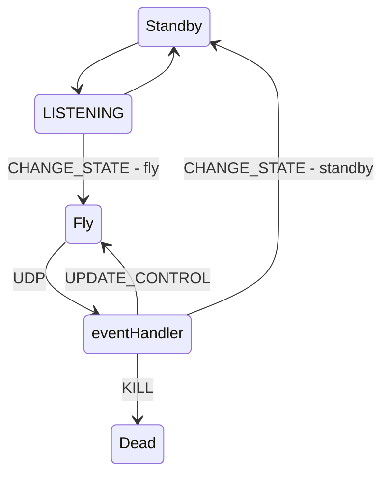

# Drone Ground Station Code

This code is meant to control N number of drones on a WIFI network with a custom UDP protocol. It will also host a server with a frontend and exposed APIs that can be used to control the drone.

## Drone State Machine

Each drone, at a high level, is an event-driven State Machine. The two high level states are "flying" and "landed", and the drone transitions between the two based on UDP messaging. Here is the entire state machine:



From this, a design becomes apparent. There are three main UDP commands that need to be made: `KILL`, `CHANGE_STATE` and `UPDATE_CONTROL`.

### KILL

The kill command is a safety feature that completely shuts off the drone - immediately putting the drone into the 'dead' state. The dead state definition is: All motor thrust set to ZERO, regardless of control input. When in 'dead' state, a `CHANGE_STATE` event is required to exit the state. 

### CHANGE_STATE

This command has a payload field of `state`, which is the state to be switched to. 

```typescript
type StateChangePayload = {
  state: string;
};
```

### UPDATE_CONTROL

This command updates tells the drone to update it's PID control setpoints. This is how drones are controlled. Currently there are 4 fields within the payload: three angular rates and a Z value. When the drone receives these, it updates the PID setpoints, which will change the motor values.

```typescript
type UpdateControlPayload = {
  gyroX: number;
  gyroY: number;
  gyroZ: number;
  Z: number;
};
```